# 桌面端按钮与真实功能审计（2026-07-28）

## 结论

本轮按 `FRONTEND_REFACTOR_FEATURE_INVENTORY.md` 中 DESK-001–DESK-025、当前桌面代码、托盘代码、真实测试夹具和后台窗口截图逐项核对。

- 没有发现已经实现的桌面业务能力被删除或改成空按钮。
- 发现 1 个高优先级可达性回归：下载任务详情会把当前状态不可用的五个动作直接隐藏，导致用户无法知道“停止 / 重试 / 补导 Eagle / 文件位置 / 来源网页”仍然存在。
- 已改为五个动作始终显示，只按真实状态置灰；可用性仍由原状态机、文件存在检查和安全边界决定。
- 视频号、IDM、设置、诊断和托盘的主要功能入口都在，并且仍连接原业务方法。
- 视频号旧版“交付方式单选 + 创建下载任务”已被两个更明确的直接动作替代，不属于功能丢失。

## 审计方法与边界

- 只读取确定性的测试夹具窗口，使用窗口句柄后台截图。
- 不监听键盘、不移动鼠标、不激活窗口、不抢焦点。
- 覆盖 1120×760 主尺寸，并对下载任务页补测 900×600。
- 对每个入口同时核对：界面文案、回调方法、后端动作、状态启停和已有测试证据。
- 本轮不恢复已经明确退役的浏览器下载器、录屏器、旧工具页、第三方下载通道或 FFmpeg/WASM 前端处理入口。

## 逐页截图与结果

### 1. 下载任务：活动状态

修复前只显示当前可用的“停止”和“来源网页”，其他真实能力完全不可见。

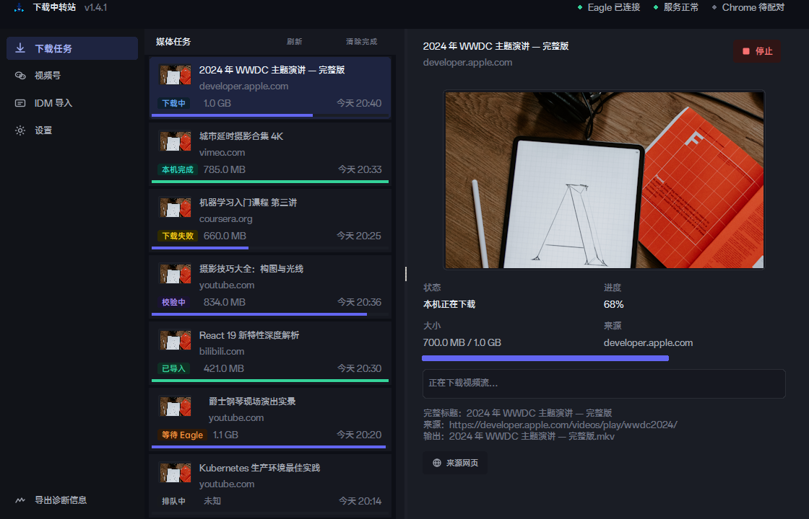

修复后五个状态动作固定出现；当前可用项保持正常强调，不可用项置灰。

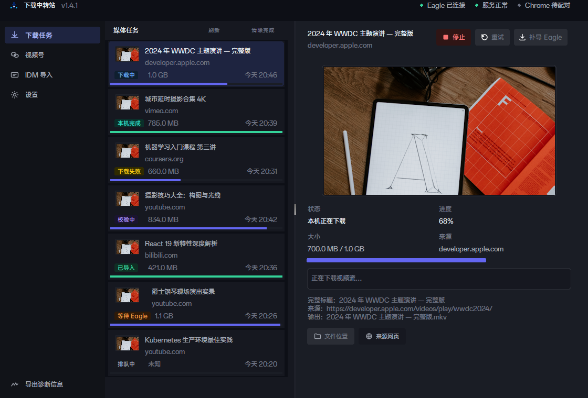

### 2. 下载任务：已完成状态

“补导 Eagle”“文件位置”“来源网页”按真实状态启用；“停止”“重试”保留但置灰。

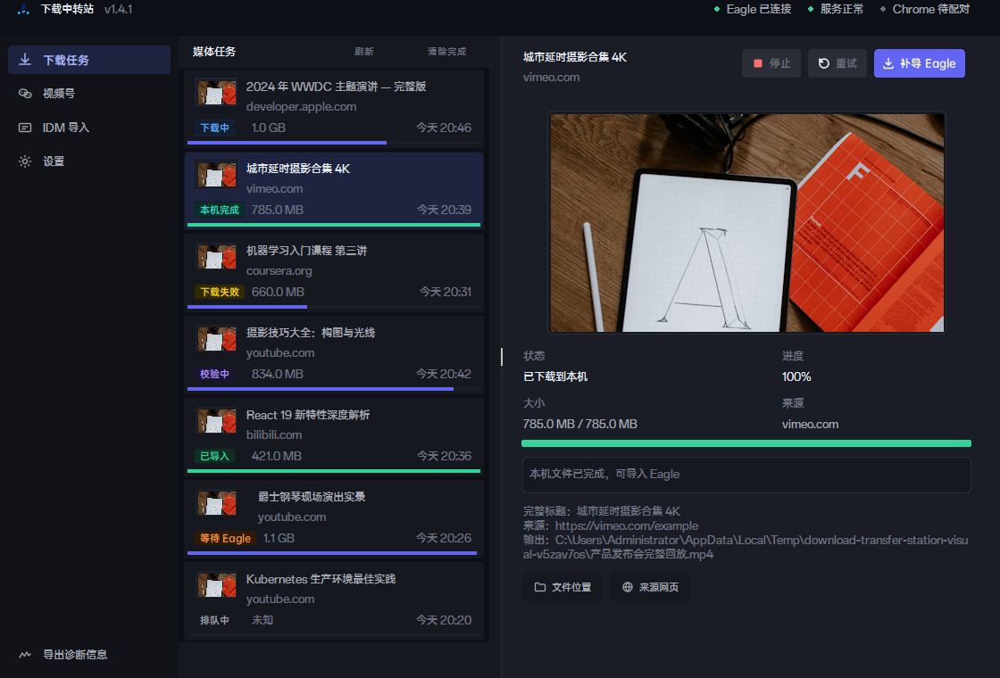

### 3. 下载任务：失败与紧凑窗口

900×600 下“重试”仍在首屏并可用；其他动作不再被删除，详情可通过本页滚动继续到达。

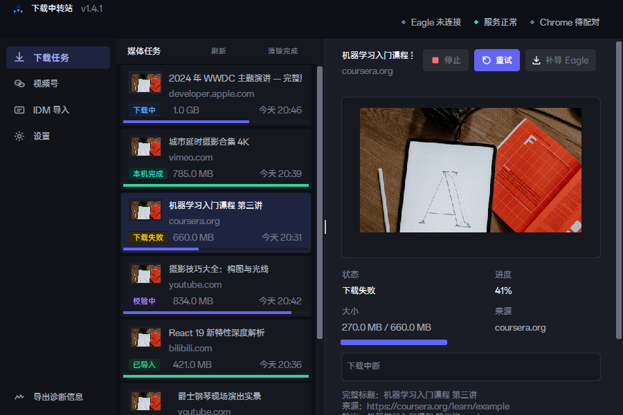

### 4. 视频号

捕获开关、刷新、清空、质量选择和两个交付动作都存在。两个交付动作分别对应“导入 Eagle 后删除本机副本”和“仅下载并保留本机文件”。

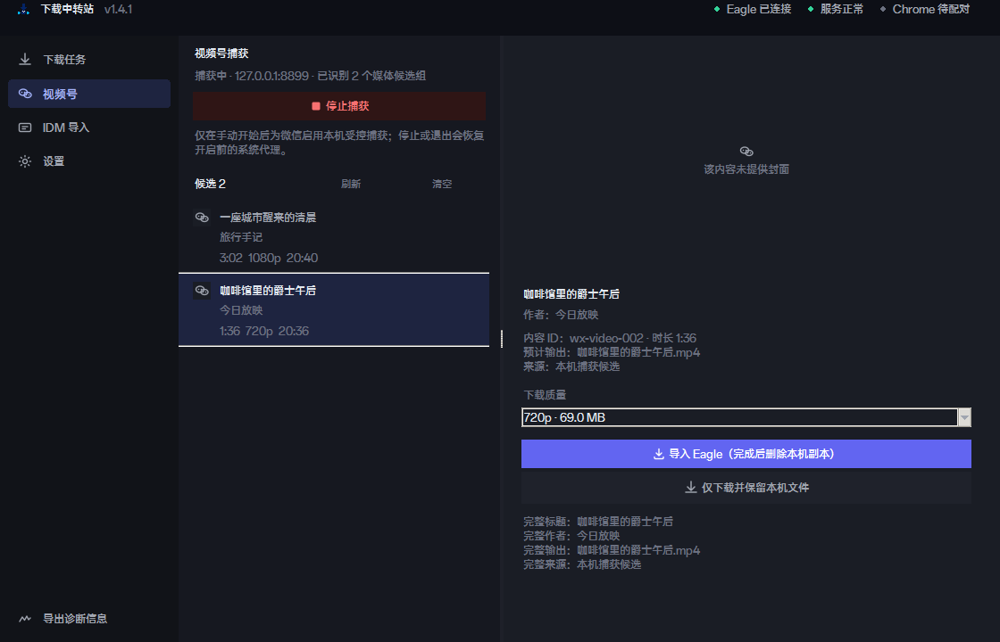

### 5. IDM 导入

刷新、清除完成、重试导入、原文件位置、可靠来源、补充或修改来源均存在；不可用动作保留并置灰。

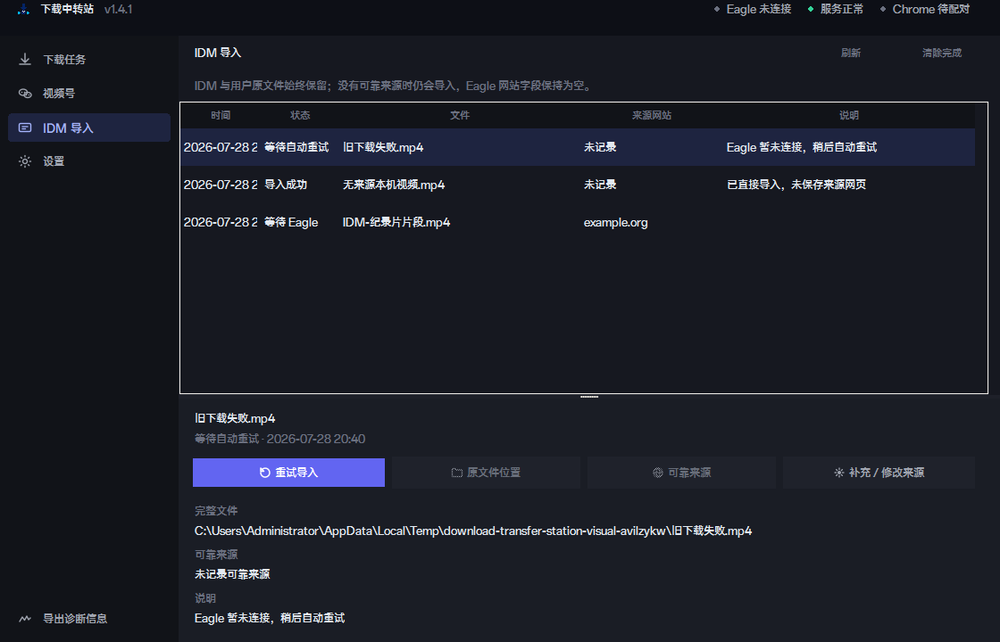

### 6. 设置：配对

复制六位码和解除配对均存在；继续使用原配对管理和安全流程。

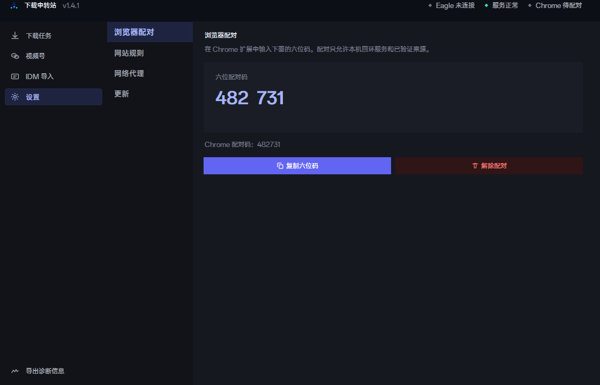

### 7. 设置：网站规则

新增并启用、开启或关闭、切换子域名、删除、清空全部规则均存在。

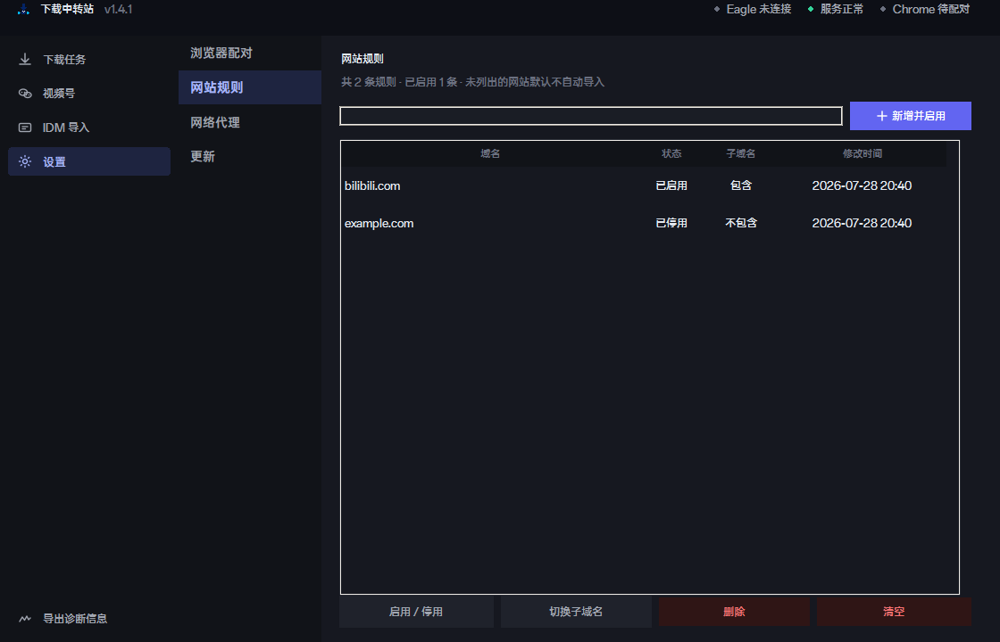

### 8. 设置：网络与更新

自动、直连、手动代理三种模式及“保存并检测”均存在；更新页保留真实检查、确认下载和安装流程。

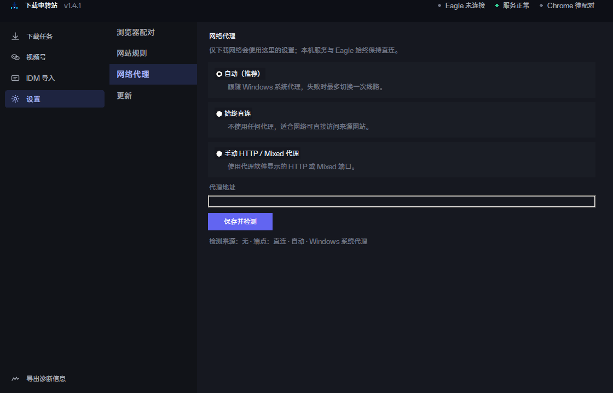

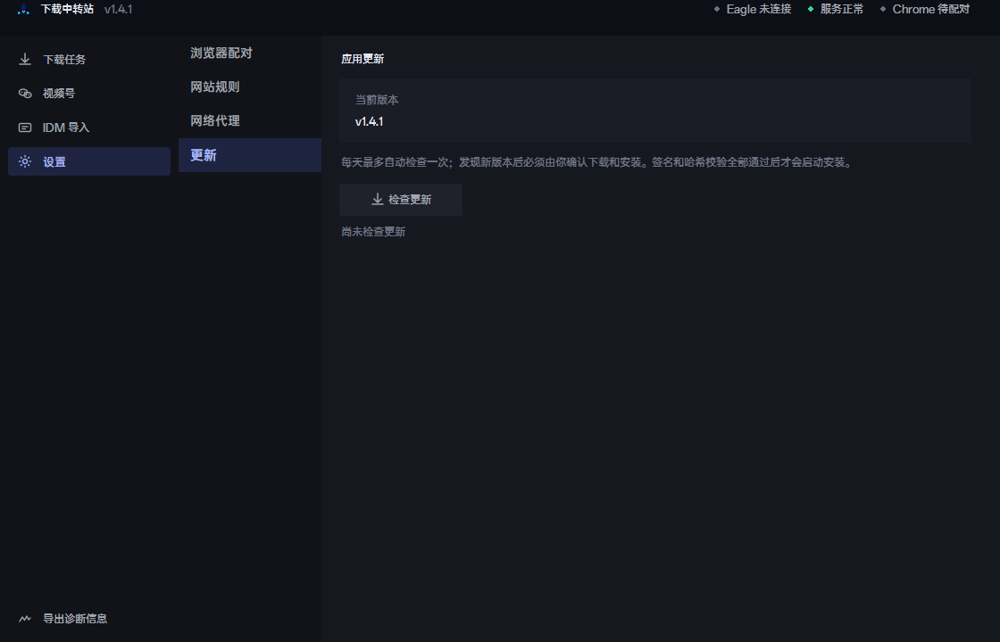

### 9. 诊断与窗口

导出脱敏诊断和最小化入口均存在；导出仍遵守不包含令牌、Cookie、完整路径、完整来源、网站规则和代理认证信息的边界。

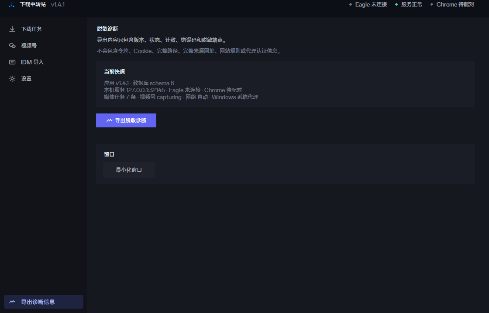

## 功能入口矩阵

| 区域 | 用户入口 | 真实动作 | 本轮结果 |
|---|---|---|---|
| 下载任务 | 刷新 | 刷新媒体计划和详情 | 已接入 |
| 下载任务 | 清除完成 | 只清理终态记录，不删媒体文件或 Eagle 内容 | 已接入 |
| 下载任务 | 停止 | 停止选中且仍活跃的计划 | 已接入；改为常驻显示 |
| 下载任务 | 重试 | 重试真实可重试的失败计划 | 已接入；改为常驻显示 |
| 下载任务 | 补导 Eagle | 对本机已完成文件补导，不重新下载 | 已接入；改为常驻显示 |
| 下载任务 | 文件位置 | 按计划编号打开受管控输出位置 | 已接入；改为常驻显示 |
| 下载任务 | 来源网页 | 打开计划记录的可靠来源 | 已接入；改为常驻显示 |
| 视频号 | 开始 / 停止捕获 | 启停受控捕获并恢复系统代理 | 已接入 |
| 视频号 | 刷新 / 清空 | 刷新或清空候选，不影响已有媒体任务 | 已接入 |
| 视频号 | 两个交付按钮 | 创建真实媒体计划并选择是否导入/删除副本 | 已接入 |
| IDM | 刷新 / 清除完成 | 刷新记录或只清终态记录 | 已接入 |
| IDM | 重试导入 | 重新唤醒可重试的导入任务 | 已接入 |
| IDM | 原文件位置 | 打开用户原文件位置 | 已接入 |
| IDM | 可靠来源 | 打开已记录的可靠来源 | 已接入 |
| IDM | 补充 / 修改来源 | 补来源；已导入记录只更新 Eagle 来源，不重复导入 | 已接入 |
| 配对 | 复制六位码 / 解除配对 | 配对码和 Chrome 配对管理 | 已接入 |
| 网站规则 | 新增、启停、子域名、删除、清空 | 数据库网站规则 CRUD | 已接入 |
| 网络 | 三种模式 / 保存并检测 | 代理配置、校验和脱敏状态 | 已接入 |
| 更新 | 检查更新 | 验签、仓库限制、大小和 SHA-256 校验、用户确认安装 | 已接入 |
| 诊断 | 导出脱敏诊断 | 导出受限健康快照 | 已接入 |
| 托盘 | 显示窗口、网站规则、唤醒处理、检查更新、退出 | 原生托盘信号与安全退出 | 已接入 |

## 发现的问题与处理

### P0：状态动作被条件隐藏

**影响：** 用户只看得到当前可点击的一两个按钮，无法理解其他能力会在什么状态出现，也会误判为功能没有接入。

**处理：** 五个下载任务动作现在固定存在；只改变启用、禁用和颜色，不再改变是否显示。没有放宽任何业务权限，也没有绕过文件存在、安全路径或状态检查。

### P1：部分全局能力位于二级页面或托盘

网站规则、网络代理、更新、诊断和“唤醒处理”分别位于设置、诊断页和托盘，主页面不会同时铺开所有按钮。这是信息架构，不是功能缺失；当前路径均可到达。

### 可访问性说明

当前截图可确认按钮可见、禁用状态和紧凑尺寸下的可达性；截图不能单独证明读屏标签、完整键盘顺序和焦点朗读质量。现有下载任务自绘按钮支持 Tab 焦点、Enter 和空格触发，后续仍应做一次专门的键盘与读屏检查。

## 验收标准

- 五个下载任务动作在无选择、活动、失败、本机完成、已导入等状态下都保持可见。
- 只有符合真实状态和安全条件的动作可点击。
- 900×600 不因缩窗永久隐藏功能，详情滚动可到达下方动作。
- DESK-001–DESK-025 的唯一可达路径均保留。
- 不新增空按钮，不恢复已退役或不安全的下载通道。

## 验证与安装结果

- 185 项 Python unittest：通过。
- 6 组 Node 前端逻辑测试：通过。
- 17 个活动 JavaScript 文件语法检查：通过。
- Chrome / Firefox 两份活动清单 JSON：通过。
- 1.4.1 发行包重新构建完成；ZIP SHA-256 为 `7ce70b7ed81aa6d77827981c3752984e084dcaa168ecfc46a400804e84994b98`。
- 当前电脑已静默覆盖安装；安装目录后台程序与本轮发行包 SHA-256 一致。
- 安装后本机健康接口返回 `version=1.4.1`、`databaseSchema=6`、`mediaReady=true`、`downloadEngine=desktop_ffmpeg`。
